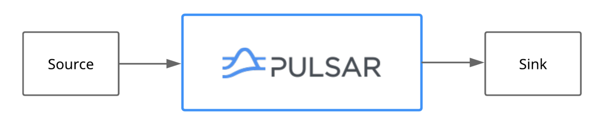

<h1 align="center">Pulsar IO CustomConnector</h1>
This repository shows how to create a custom pulsar connector.

# Introduction:
Pulsar IO connectors enables us to easily create, deploy, and manage connectors that interact with external systems, such as MongoDb, Apache Kafka and many others.
Pulsar IO connectors come in two types: **source** and **sink**.



# Development
We can develop Pulsar source connectors and sink connectors.
## Source
To develop a source connector, we should implement the **Source** interface and need to override the **open** and **read** method.
```java
/**
* Open connector with configuration
*
* @param config initialization config
* @param sourceContext
* @throws Exception IO type exceptions when opening a connector
*/
void open(final Map<String, Object> config, SourceContext sourceContext) throws Exception;
```
```java
/**
    * Reads the next message from source.
    * If source does not have any new messages, this call should block.
    * @return next message from source.  The return result should never be null
    * @throws Exception
    */
    Record<T> read() throws Exception;
```
## Sink
To develop a sink connector, we should implement the **Sink** interface and need to override the **open** and **write** method.

```java
/**
    * Open connector with configuration
    *
    * @param config initialization config
    * @param sinkContext
    * @throws Exception IO type exceptions when opening a connector
    */
    void open(final Map<String, Object> config, SinkContext sinkContext) throws Exception;
```
```java
/**
    * Write a message to Sink
    * @param record record to write to sink
    * @throws Exception
    */
    void write(Record<T> record) throws Exception;
```

# Local Setup
- Run the command mvn clean install.
- Copy the generated NAR files to the connector's directory of apache pulsar.
- start the sink connectors

